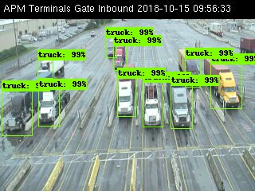

# Homework Assignment - Research Engineer

Your assignment is to design and build a **service** (a web app) that will use
an existing machine learning model to respond to incoming requests.

In the following sections, we will describe in detail what you need to do.

## Machine Learning Concepts

### Machine Learning Models

In machine learning, a **model** is umbrella term that, in the broadest sense,
represents a mathematical function that receives input data, and produces some
output data. For example:

- regression models predict output based on input, e.g. ambient temperature for
  tomorrow based on historical measurements
- classification models assign a label denoting some category to input data,
  e.g. given an image of some fruit, model decides what kind of fruit it is -
  apple, orange, banana etc.
- object-detection models detect objects on input images, e.g. given an image
  of a crowd of people, model draws a rectangle - also called a _bounding box_ -
  around each person in the image
- any combination of the above and much, much more

In this task, you are provided with an **object-detection model** that
detects trucks on input images.

### Model Training and Inference

_Learning_ in machine learning stands for the ability of models to "learn"
causalities and dependencies between input data and output data, thus getting
better - improving accuracy of their output - over time. This happens
during a process called **training**.

When you initially create a model, its performance is very bad - it will output
pretty much random results for any input given. During training, model's
performance slowly improves. Training is often times computationally intensive
and lasts for a long time - it is not uncommon for training to last for days or
weeks, and utilize multiple CPUs and GPUs.

Once model reaches satisfactory level of performance, usually measured in
accuracy, we can then actually use the model. We give the model novel data it
has not seen before, and we let it compute the output. This process is called
**inference**.

To summarize, in order to solve a machine learning problem, you:
1. Build a model (designing)
2. Train it (training)
3. Run it (inference)

In this assignment, model you are provided with has already been trained, and
you will be dealing with the last part, **inference**.

### Provided Model

The model you are provided with is an object-detection model that detects
trucks on specific camera images. The camera is fixed, and it monitors arrival
of trucks to cargo delivery area around the clock. These trucks orderly wait in
multiple lanes to deliver their cargo.

Here are a couple of examples of input images:


For each object detected, the model outputs 4 bounding box coordinates, a class
label and a confidence score in `[0, 1.0]` range. If we were to draw bounding boxes on
top of original image, we would get something like this:




To recap:
- model input is a 320x240 JPEG image
- model output is a JSON dictionary, containing the following fields:
    - `boxes` - a list of bounding box coordinates for each detected object
    - `scores` - a list of confidence scores for each detected object
    - `classes` - a list of class labels for each detected object (`1` is `truck`)

The model is provided as a frozen TensorFlow v1.x graph with weights.
[TensorFlow](https://www.tensorflow.org/) is one of the most prominent machine
learning frameworks. It is written in C++ and Python, with latter being the main API.
You are also given a Python script that can be used to run
inference on a single image - take a look at `infer.py`. This script can be
invoked with:
```bash
pip install -r requirements.txt
./infer.py --threshold 0.6 --o <output_image> <input_image>
```

## The Task

Your task is to design and build **inference service** that will make use of
this model to **count the number of trucks in each lane**. Your service will be
getting 1 such request per second, on average, throghout the day. Additionally,
your service will also calculate traffic load statistics per lane for custom
date/time ranges.

Inference service is a web app - backend only, no frontend - that serves
requests. Your service should be backed by a database. The service you are building
must have the following two endpoints:

1. **Inference endpoint**. Each request to this endpoint contains a single
   input image, and time when the image was taken. You need to:
   - parse incoming request, deserialize the image and pass it to the model as input
   - run the model and collect model output
   - count number of trucks in each lane - there are 10 visible lanes in
     input images, so you need to come up with 10 numbers, one per lane
   - store truck count in each lane in the database, along with image timestamp
   - finally, send back response containing number of trucks per lane
2. **Statistics endpoint**. Requests to this endpoint contain a date/time range,
   e.g. from `2020-03-01 12:00:00` up to `2020-03-05 15:30:35`. You need to:
   - load relevant data from the database
   - calculate maximum, minimum, median, mean and standard deviation for truck
     counts for each lane for provided time range
   - send back response containing this data

**You need to design the API**: this means protocol, request/response
format, schema, serialization, etc. Designing does not mean inventing from
scratch, but rather choosing a suitable technology for the job.

**You will need to make tech choices**: you need to choose programming
language, build tool, database etc. Your tech choices should be influenced by
requirements (stated down below) and your experience/knowledge. You should
strive to choose the best tool for the job.

You are also provided with dataset that was used during model's training
(`PortElizabethWebcam.zip`) so you can test your service while working on it.
For all intents and purposes of this task, the model is a black box to you. You
should not be concerned with how accurate nor fast it is. However, it is still
a critical component of your system-to-be.

### Rules of the Game

- You can use any programming language you want, as long as you can run
  inference with provided model. We suggest you use Python if you know it - it
  makes interop with inference script easier, but we leave the final choice
  up to you. You don't even have to use the provided script, if you know a
  different way to utilize `.pb` frozen graph.
- You can use any database you want, as long as data is persisted to disk.
- You can use build any kind of API you want, as long as we can use your API
  remotely, over the network, feed it data and get data back. In other words,
  your service needs to listen on a socket for incoming requests.
- Tech part is underspecified on purpose - we want to give you absolute freedom
  and, at the same time, get a glimpse of your decision-making process
  regarding tech and tooling.
- If you have questions write us back.
- You have one week.

### Grading and Requirements

We will be evaluating the following aspects of your solution, listed in no
specific order:

- **Correctness** - happy path needs to work. We need to be able to start your
  service on our computers, send it requests and get responses back.
- **API Design** - your design choices should be sensible. You should be
  using best practices for chosen API (REST, gRPC, etc).
- **Documentation** - you should include instructions for building,
  running, provisioning, deploying, etc. Also, your API should be documented.
- **Logging** - your service should log each request, including timestamp,
  endpoint, time request processing took, and any relevant messages to a log
  file.
- **Multiprocessing** - your service needs to be able to handle multiple
  requests at the same time. Request latency is not important - you will be
  bottlenecked by inference time. Your service needs to be able to handle at
  least 1 request per second (inference time is close to 2 seconds on a good
  PC).
- **Multiplatform** - your service needs to work on x86 computers running OS
  X, Windows and Linux.
- **Build Tooling** - you need to provide a convenient way to build your service
  from source, on another machine - which might be running a different OS and
  have a different set of libraries. Think about good build tools for language
  of your choice - even a simple `Makefile` could do.
- **Deployability** - you need to provide a way to provision a VM that will run
  your service, and deploy the most recent build to the VM. Think
  Ansible/Vagrant. Alternatively, you can provide a `Dockerfile` so your
  service can be run within a container.

All of things above are **required**. Depending on your tech choices, getting
all of them right might be easier or harder.

### Bonus Points

You get bonus points for the following:

- **Code Design** - readability, modularity, simplicity. Clear separation of
  concerns and low degree of coupling.
- **Configurability** - being able to configure various aspects of service
  operation, like log paths, model path, detection threshold, etc. via
  environment variables and config file.
- **Collecting Metrics** - metrics should be exposed on some endpoint for scraping.
  Some example metrics: number of requests, number of invalid requests,
  request latency, average number of trucks detected, number of errors etc.
- **Healthcheck Endpoint** - monitoring software needs to know your service is
  alive and well.
- **Unit/Integration Tests**
- **Version Control System** - Git, Mercurial, Subversion, Bazaar...
- **Sensible Tech Choices** - we expect you to be able to explain why you
  decided to go with specific tech, and state pros and cons of such choice.
